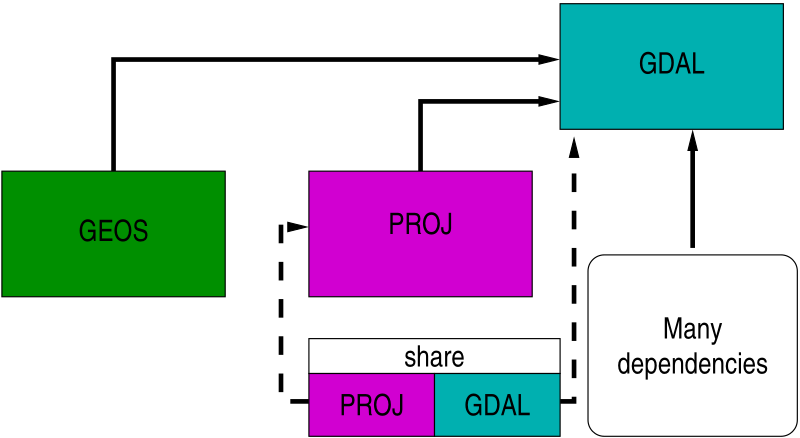
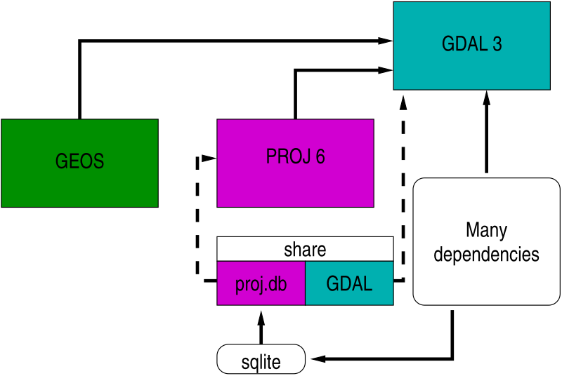
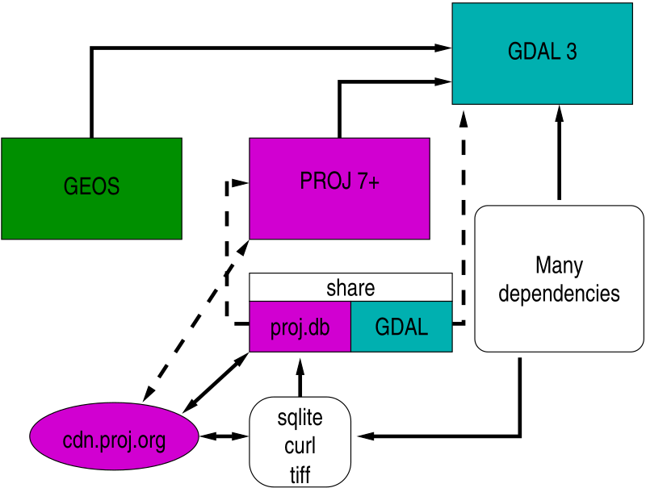
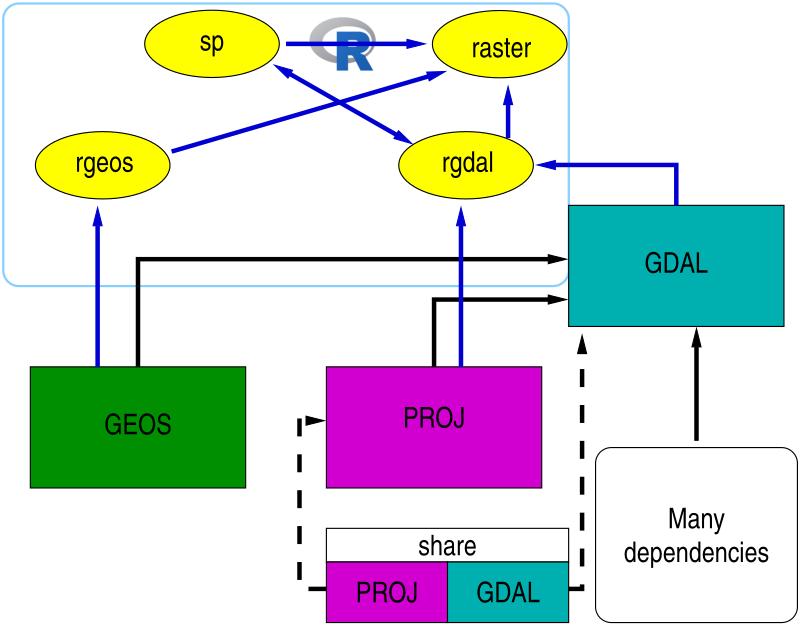
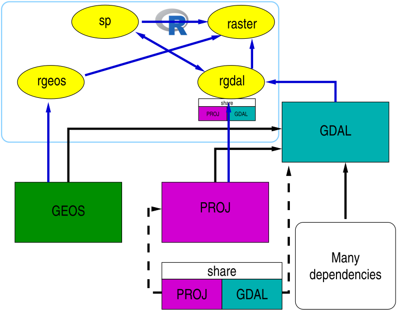
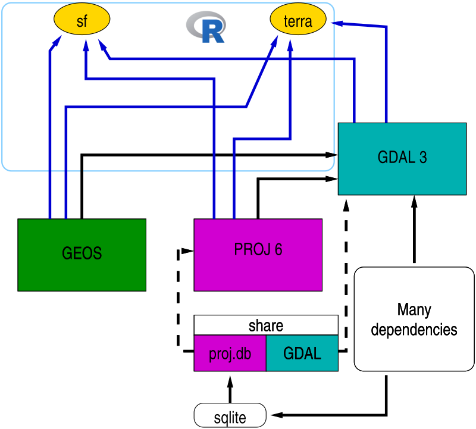
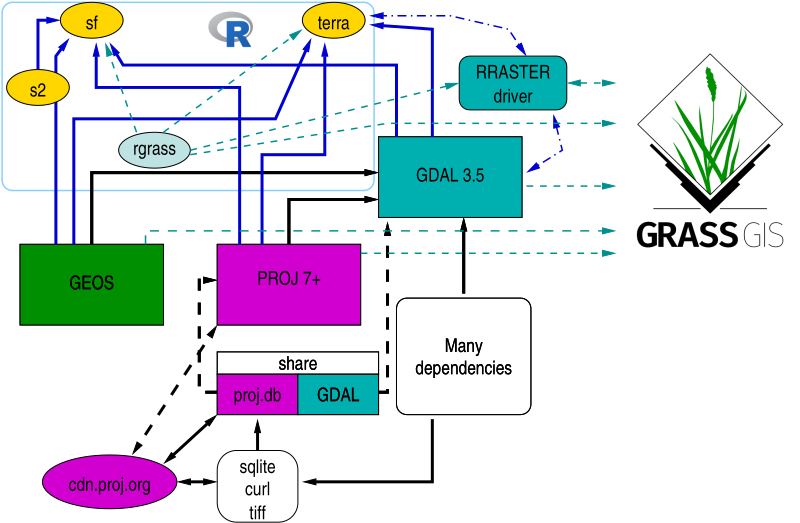
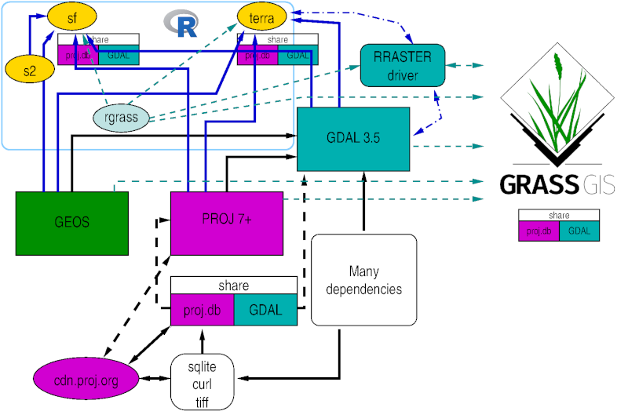

```{r setup, include=FALSE}
knitr::opts_chunk$set(echo = TRUE, paged.print=FALSE)
```

### Copyright

All the material presented here, to the extent it is original, is available under [CC-BY-SA](https://creativecommons.org/licenses/by-sa/4.0/). 

### Required current contributed CRAN packages:

I am running R 4.2.1, with recent `update.packages()`.

```{r, echo=TRUE}
needed <- c()
```

### Script

Script and data at https://github.com/rsbivand/foss4g_2022/raw/main/modernizing_220822.zip. Download to suitable location, unzip and use as basis.

## FOSS foundations and barn-raising

Both R and GRASS are FOSS. Both build on FOSS foundations, GRASS directly and R through contributed packages that the user may choose to install in R libraries.

### Before barn-raising

So what are the shared FOSS foundations? Briefly, PROJ, GEOS and GDAL, first shown in the pre-barn-raising state:

```{r, out.width=800, echo=FALSE}

```

PROJ (then often called Proj4) provides coordinate reference systems (CRS) definitions, and projection and datum transformation operations; GEOS provides planar topological predicates and operations; GDAL provides abstractions for reading, writing, manipulating and transforming GIS data using drivers for raster and vector data.

PROJ < 6 and GDAL < 3 used to ship with shared flat text files providing metadata about coordinate reference systems. Pre-PROJ 6, PROJ 5 introduced pipelines for projection and datum transformation operations [@knudsen+evers17, @evers+knudsen17]. PROJ 4 had been stuck with an outdated WGS84 (World Geodetic System 1984 and `+towgs84=` key-value pairs) datum transformation hub introducing errors of up to 2m; all datum transformations were forced through WGS84 as an intermediate product.

### Barn-raising 

Following the Barn Raising project (https://gdalbarn.com/), PROJ 6 and GDAL 3 were released together, with GDAL 3 requiring PROJ >= 6. The most obvious changes were that PROJ now stored CRS, projection and transformation metadata in an SQLite database, also used by GDAL, and that most of the legacy flat text files were replaced by database tables. The database file made it much easier to adopt OGC WKT2 (2019) for specifying CRS. This provided the information needed to drop the WGS84 transformation hub in most cases, and to construct direct transformation pipelines from database lookup:


```{r, out.width=800, echo=FALSE}

```

### CDN or bundle grid files?

The most accurate direct transformation pipelines may need transformation grids rather than 3 or 7 parameter transformation models applied equally over the area of interest. While the legacy `proj-datumgrid` zipfile never exceeded 6.3 MiB, the current `proj-data` zipfile is 562.5 MiB (https://download.osgeo.org/proj/). Since it is unlikely that users need transformation grids for all continents, one can download by continent (Oceania, North America, Europe), or for global transformations, but these are still all large. The volume of transformation grids released under permissive licenses and hosted by the CDN will continue to increase rapidly.

Instead of installing lots of unneeded grids, which may become stale, use can be made of an on-demand content download network https://cdn.proj.org from within PROJ, using CURL for download and TIFF as the unified grid format (Cloud Optimized GeoTiff). On-demand use creates a user-writeable `cache.db` SQLite database of grid chunks, which may be used across applications looking at the same `PROJ_LIB` directory:

```{r, out.width=800, echo=FALSE}

```

## Modernizing R packages

### Pre barn-raising

When the first R-GRASS interface package was written [@bivand:00], a small subset of GRASS GIS library was included in the R package **GRASS**, to permit GRASS 5 rasters to be read and written. When the R package **rgdal** became available, the next two interface iterations **spgrass6** for GRASS 6 and **rgrass7** for GRASS 7 used it to read and write temporary raster and vector files using GDAL. In addition to the GRASS interface packages, many other R packages used the functionality of PROJ and GDAL then provided by **rgdal**:

```{r, out.width=800, echo=FALSE}

```

One complication on platforms such as Windows and macOS for which the R archive network provides binary packages, is that the PROJ and GDAL shared metadata files are bundled:

```{r, out.width=800, echo=FALSE}

```

The versions of these metadata files may differ from those bundled with other binary software (such as OSGeo4W or the GRASS Windows standalone).

### Addressing barn-raising in R packages

@bivand:21 describes the steps taken to modernize **rgdal** as a useful place to prototype adaptations. For vector data, the **sf** simple features package is strongly recommended for new work, while for vector and raster spatial and spatio-temporal arrays, **stars** may be used. Both of these are part of the informal `r-spatial` GitHub organization (https://r-spatial.org, https://github.com/r-spatial). **sf** links to PROJ, GDAL and GEOS, so is able to replace **rgdal** and **rgeos**. **rgdal** perhaps uses PROJ directly rather than PROJ through GDAL, but most of what was learned about changes in PROJ and GDAL is shared.

In addition, **rgdal** had been used extensively by the **raster** package, which itself did not link to external software libraries. **raster** is being re-implemented in the **terra** package, which is now almost complete. **terra**, like **sf**, links to PROJ, GDAL and GEOS, so provides the same file handling functionality as **rgdal** with regard to the R-GRASS interface, but for both vector and raster objects. **rgdal**, **sf** and **terra** can use the WKT2 (2019) CRS representation.

```{r, out.width=800, echo=FALSE}

```

### GDAL RRASTER driver

GDAL has had an `RRASTER` raster driver to read and write files created by the R **raster** package since 2.2 (https://gdal.org/drivers/raster/rraster.html#raster-rraster). Until 3.5, the driver used Proj4 strings to represent CRS, but from 3.5.0 may also use WKT2 (2019) as the preferred representation (for **terra** and **raster**; the latter uses pure R code not GDAL). 

## Modernizing the R-GRASS interface 

Simply permitting the **rgrass7** package to interface GRASS 8 as well as GRASS 7 was not sufficient, because **rgdal** will be retired during 2023. So **rgrass** is the new interface package. It has been tested with GRASS 7.8.6 as well as GRASS 8. After examining the use of **sf** and **stars** compared to **terra**, it was found that of the packages providing services from PROJ, GEOS and GDAL, **terra** was a better fit, in having object structures more like traditional GIS. **sf** is innovating fast, including the use of **s2** for spherical geometry topology predicates and operations, and spatio-temporal arrays in **stars**; these may be needed later, but for now **terra** is a good fit for the needs of the interface:

```{r, out.width=800, echo=FALSE}

```


```{r, out.width=800, echo=FALSE}

```

## References